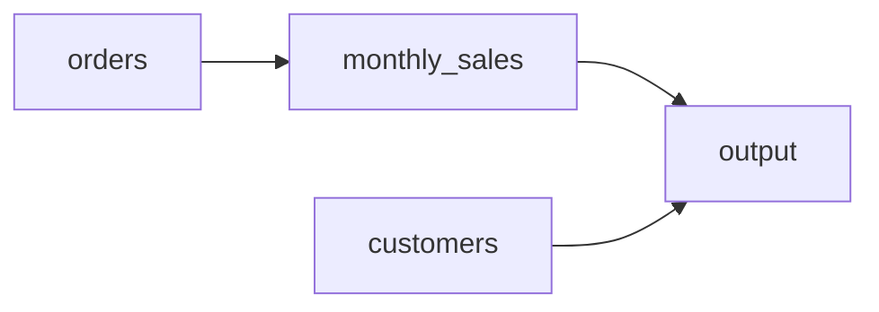

FlowScope visualizes SQL lineage as an interactive graph. This guide explains how to read the graph, understand different node types, and navigate complex lineage structures.

## Graph Overview

The lineage graph shows data flow from left to right:

- **Source tables** appear on the left
- **Intermediate transformations** (CTEs, subqueries) in the middle
- **Target tables or output** on the right
- **Edges** connect nodes showing data flow direction

## View Modes

FlowScope offers multiple view modes for different analysis needs:

### Table-Level View

Shows relationships between tables without column details. Best for:

- Understanding high-level data flow
- Viewing large queries with many tables
- Quick impact analysis

### Column-Level View

Shows how individual columns flow through transformations. Best for:

- Tracing specific column origins
- Understanding aggregations and calculations
- Detailed impact analysis

### Hybrid View

Combines table and column views—tables shown with expandable column sections. Best for:

- Exploring lineage at both levels
- Starting high-level then drilling down

### Script View

Groups lineage by SQL statement or file. Best for:

- Multi-file project analysis
- Understanding execution order
- File-level impact analysis

## Node Types

### Table Nodes

Represent database tables:

- **Blue** - Source tables (read from)
- **Green** - Target tables (written to)
- **Gray** - External/unknown tables

Table nodes display:
- Table name
- Column list (in column-level view)
- Row count (if available from schema)

### CTE Nodes

Represent Common Table Expressions:

- Shown as intermediate nodes
- Can be hidden with "Hide CTEs" toggle
- Edges bypass hidden CTEs to show direct lineage

### Output Nodes

Represent query results:

- Appear for SELECT statements without target table
- Show final column list
- Named as "Query Result" or custom alias

## Column Node Details

In column-level view, each column shows:

| Element | Description |
|---------|-------------|
| **Name** | Column name or alias |
| **Type** | Data type (if schema provided) |
| **Origin** | Direct, Derived, or Aggregated |
| **Expression** | Transformation applied (for derived columns) |

### Column Origins

- **Direct** - Column passes through unchanged
- **Derived** - Column computed from one or more sources
- **Aggregated** - Column involves aggregation (SUM, COUNT, etc.)
- **Unknown** - Cannot determine origin (missing schema)

## Edge Types

Edges (arrows) represent data flow:

| Edge Type | Description |
|-----------|-------------|
| **Solid** | Direct column mapping |
| **Dashed** | Indirect relationship (JOIN condition) |
| **Thick** | Multiple columns flow along this path |
| **Colored** | Grouped by source table |

### Edge Confidence

FlowScope assigns confidence levels to lineage:

- **High** - Explicit column reference
- **Medium** - Inferred from context
- **Low** - Best guess (e.g., SELECT *)

## Navigation Controls

### Zoom and Pan

- **Mouse wheel** - Zoom in/out
- **Click and drag** - Pan the canvas
- **Double-click** - Zoom to fit

### Control Panel

| Control | Action |
|---------|--------|
| **Fit** | Zoom to show entire graph |
| **Zoom In/Out** | Adjust zoom level |
| **Reset** | Return to default view |
| **Minimap** | Toggle overview minimap |

### Node Interaction

- **Click node** - Select and show details
- **Double-click node** - Focus on connected nodes
- **Right-click node** - Context menu with options
- **Hover edge** - Show lineage details

## Focus Mode

Focus mode highlights lineage for a specific node:

1. Select a node
2. Click "Focus" or press `F`
3. Only connected nodes and edges remain visible
4. Press `Escape` or click "Clear" to exit

### Focus Directions

- **Upstream** - Show where data comes from
- **Downstream** - Show where data flows to
- **Both** - Show full lineage chain

## Search

Find nodes by name:

1. Press `/` or click the search icon
2. Type table or column name
3. Matching nodes highlight
4. Press `Enter` to focus first match

Search supports:
- Partial matching
- Case-insensitive search
- Regular expressions (prefix with `/`)

## Filtering

### Hide CTEs

Toggle "Hide CTEs" to simplify the graph. CTE lineage is preserved through bypass edges connecting original sources to final outputs.

### Filter by Table

Select tables to include or exclude from the view. Useful for focusing on specific data flows in large graphs.

### Filter by Statement

In multi-statement analysis, filter to show lineage for specific statements only.

## Layout Algorithms

FlowScope offers multiple layout algorithms:

| Algorithm | Best For |
|-----------|----------|
| **Dagre** | Hierarchical layouts (default) |
| **Elk** | Complex graphs with many crossings |
| **Manual** | User-positioned nodes |

Switch layouts in the settings panel. Manual positioning is preserved when switching back.

## Exporting Visualizations

### Screenshot

Export the current view as a PNG image:

1. Adjust zoom and pan to frame your view
2. Click "Export" → "Screenshot"
3. Image downloads at current resolution

### Mermaid Diagram

Export as Mermaid diagram syntax for documentation:

### Interactive HTML

Export a self-contained HTML file with full interactivity for sharing.
